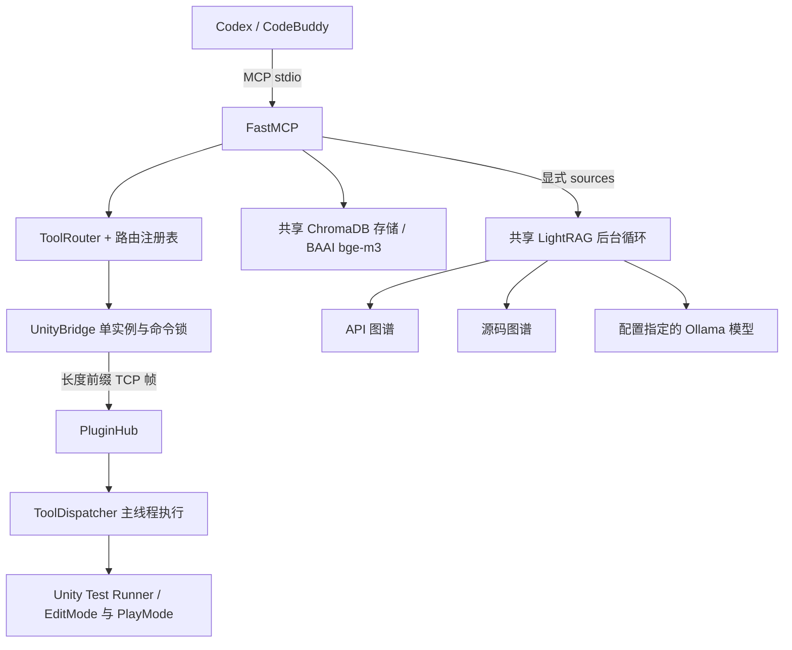

# 架构与边界

## 配置和工具

`UnifiedServerConfig` 在启动入口加载环境配置，命令行覆盖相应值，生命周期初始化不再次覆盖。图谱默认 `gemma3:4b`，Embedding 保持 `BAAI/bge-m3`；源码生成和评分模型仍按各自用途配置。

MCP 装饰器的 `group:*` 标签是分组唯一来源。注册后、对外服务前验证分组并移除禁用工具，再生成分组统计；未知分组导致启动失败。Unity 临时离线不删除已实现工具，调用时报告连接状态。显式启用尚未接通的 ACL、加密或审计开关会报不支持。

固定 handler/action 映射由现有 `tool_action_registry.json` 和 `ToolRouter` 管理；工具函数负责参数转换。组合操作可复用底层桥接。Unity 自动发现类上的 `McpTool` 与方法上的 `McpToolAction`；重复注册报错。

stdout 的二进制流由 MCP SDK 用于协议，普通 Python 文本输出和服务日志走 stderr 或日志文件。依赖安装属于安装阶段，图谱查询不调用第三方自动安装入口。

## 检索

同一规范化路径复用存储对象，API 和源码图谱保持独立目录。未指定 `sources` 时仅检索向量；兼容参数 `include_graph_context=True` 启用向量与 API 图谱，`False` 只用向量，显式 `sources` 优先。

MCP 和内部任务异步等待；CLI 同步包装复用同一个实现。LightRAG 使用现有后台循环，图谱默认总预算 60 秒，包含排队与初始化。超时或取消会取消已提交的协程并释放查询名额；已经开始的本地模型加载线程不能强行终止，复用同一个初始化任务以避免重复加载。

`source_breakdown` 区分 `ok`、`empty`、`unavailable`、`timeout`、`error`。部分失败保留其他来源，全部失败返回 `error`。`merged_answer` 仅拼接本次证据。向量提供已知文档 ID、来源和 Unity 版本，缺失字段留空；`include_full_content=True` 返回选中文档全文。图谱使用 LightRAG 上下文 token 预算，不再截断前 2000 字符。

## Unity 连接与执行

保持 8 字节大端长度前缀和 UTF-8 JSON 帧，最大 64 MB。单例连接及其命令锁在断线后仍为同一个对象。

每个 Unity 进程维护独立心跳，包含项目路径、PID、端口与时间；退出只删除自己的记录。网络线程读取主线程采集的项目信息缓存。配置 `UNITY_MCP_PROJECT_PATH` 可固定目标；未配置时只自动选择唯一新鲜实例，多实例返回候选。连接和重连都会核验实际项目，绝不静默切换。

连接建立前可以重试。修改命令开始发送后若响应丢失，返回“执行结果未确认”，不重发；只有明确列入只读白名单的操作可安全重试。超时、取消和损坏响应关闭当前连接，防止迟到响应污染后续命令。Unity 清理尚未执行的过期或断开连接的请求；已开始的命令不能宣称撤销成功。

刷新返回 `submitted` 或 `compiling`，继续读取编辑器状态和编译错误来判断 `completed` / `failed`。脚本验证使用实际编译错误，断线不代表刷新成功。

`run_tests` 通过同一路由与桥接提交 Unity Test Runner 任务；Python 异步等待，只有状态查询允许安全重试。Unity 回调跨域重载重新注册，结果保存在项目 Library 内并支持按运行 ID 续查。测试框架引用集中在一个 Editor 程序集，避免改变现有主插件程序集结构；不新增通用任务平台。

## 边界

保持客户端 → FastMCP → 检索或 UnityBridge → 插件的结构，不引入代理框架、备份系统或通用服务层。资产库和源码适配继续使用现有服务。未实现的 MCP 入口被删除，功能数量不作为可用性承诺。
